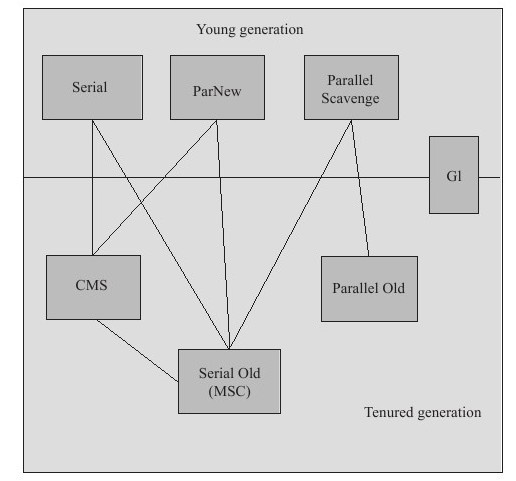
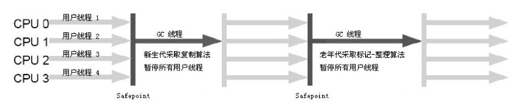
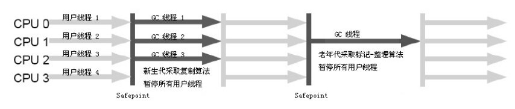
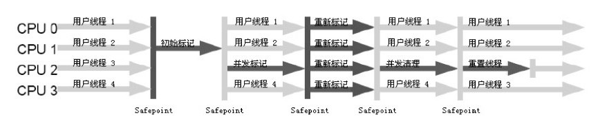

# 垃圾收集器(垃圾收集算法的具体实现) 

各个厂商、不同版本的虚拟机所提供的垃圾收集器可能会有很大差别，这里主要讨论HotSpot虚拟机

## 总图

## 声明：

目前没有一种任何场景都适用的垃圾收集器

## 详细：

## Young Generation (新生代)

### Serial(顺序的)收集器(复制算法)

示意图：

一个单线程进行收集，Stop The World。

**虚拟机参数**:

- -XX:SurvivorRation            复制算法 中Eden与Survivor的比率 默认8:1
- -XX:PretenureSizeThreshold    新生代晋升老年代的阀值
- -XX:HandlePromotionFailure等

优点：在单CPU下，没有线程开销，效率较高。

缺点：停顿时间过久

### ParNew收集器(Serial多线程版本)(复制算法)

示意图：

**虚拟机参数**:

- -XX:+UseConsMarkSweepGC   默认新生代收集器
- -XX:+UseParNewGC          强制使用ParNew收集器
- -XX:ParallelGCThreads     限制垃圾收集的线程数

优点:
- 在多Server模式下首选
- 除了Serial收集器外，唯一能够和CMS收集器配合工作的收集器
- 在多CPU中，一般数量和CPU数量相等，效率较好

缺点:
- 在单CPU下，线程切换开销较大

### Parallel Scavenge收集器(复制算法)

并行的的多线程收集器

**特点**：

- 关注点与其他收集器不同。关注点为可控吞吐量,能够根据需求精准控制吞吐量
- 不能与CMS配合
- 有自己的的收集器，不过实现与Serial Old收集器相似

> 吞吐量：

> 吞吐量 = CPU运行用户代码时间 / (运行用户代码时间+垃圾收集时间) 例如：用户程序时间100分钟，垃圾收集1分钟，吞吐量为99%

> 高吞吐量：合理利用CPU时间，尽快完成程序的运算任务，主要适用于后台运算而不需要太多交互任务
> 低吞吐量：对于用户交互，那么就需要良好的相应速度。

**虚拟机参数**:

- -XX:MaxGCPauseMills    设置最大垃圾收集器停顿时间  大于0的毫秒数 (牺牲吞吐量和新生代空间的代价)

- -XX:GCTimeRatio        直接设置吞吐量大小         大于0小于100的整数：垃圾收集器占用时间：eg: 设置19，GC最大时间占用5%(1/1+19),默认99，就是1%(1/1+99)的垃圾收集时间

- **-XX:+UseAdaptiveSizePolicy**    打开后，虚拟机会根据当前系统的运行情况，动态调整
  - 新生代的大小(-Xmn)
  - Eden与Survivor区的比例(-XX:SurvivorRatio)(ps:复制算法) 
  - 晋升老年代对象年龄(-XX:PretenureSizeThreshold)等
  - > 使用：只需要设置基本内存数据，然后关注最大停顿时间或者吞吐量就行了
  
## Tenured Generation  (老年代)

### Serial Old收集器(标记-整理算法)

示意图:

Serial 的老年代收集器(标记整理)

优点:
- 单CPU效率高，Client模式下
- 可以作为CMS的后备预案

### Parallel Old收集器(标记-整理算法)

示意图:

Parallel Scavenge收集器的老年代(标记-整理)的版本

设计目的：由于不能和CMS配合使用，老年代就只能使用Serial Old收集器，而Serial Old收集器对于服务器应用明显是种拖累。
就算新生代有良好的吞吐性，但是在老年代就会比较拖累，所以整体吞吐量也不能上去

### **CMS(Concurrent Mark Sweep)收集器**(标记-清除算法)

设计目标:获取最短回收停顿时间为目标

特点:并发，标记

示意图:

步骤:
1. 初始标记

2. 并发标记

3. 重新标记

4. 并发清除

## G1收集器

