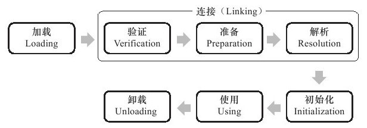

# 类加载机制

---

## 类的生命周期

示意图:

1. *加载(Loading)
2. *验证(Verification)
3. *准备(Preparation)
4. 解析(Resolution)
5. *初始化(Initialization)
6. 使用(Using)
7. *卸载(Unloading)
> 加*为必要的且必须按顺序执行

### 加载 

没有进行强制约束

步骤：
1. 通过一个类的全限定名来获取定义此类的二进制字节流
2. 将这个字节流所代表的静态存储结构转化为方法区的运行时数据结构
3. 在内存中生成一个代表这个类的java.lang.Class对象

### 验证

确保Class文件的字节流符合虚拟机要求，并且不会危害虚拟机安全。

1. 文件格式上的验证(文件验证)
  - 魔数
  - 主次版本号
  - 常量池是否有不支持类型
  - 常量池指向是否有不存在或者不符合类型的常量
  - CONSTANT_Utf8_info常量是否有不符合UTF8编码数据
  - class文件各个部分是否有被删除或者附加

2. 元数据验证(语义验证)
  - 是否有父类
  - 是否继承了不被允许继承的类(final修饰的类)
  - 不是抽象类，是否实现了父类或者接口要求的方法
  - 类中字段，方法是否与父类产生矛盾

3. 字节码验证
  - 保证操作数栈能够正常工作
  - 指令跳转不会到方法外
  - 类型转换有效

**虚拟机参数**:
- -XX:-UseSplitVerifier     给方法体的Code属性添加StackMapTable的属性
- -XX:+FailOverToOldVerifier 要求类型校验失败的时候退回旧的类型推断

4. 符号引用验证
- 能否通过字符串描述的全限定名找到对应的类
- 在指定类中是否存在符合方法的简单名称描述的方法和字段
- 符号引用中的类，字段，方法的访问性是否可被当前类访问

### 准备

### 解析

### 初始化

5种情况必须初始化:
1. new 一个对象，读取或者设置类的静态字段
2. 反射对类进行调用的时候，如果没有进行过初始化就要初始话
3. 先初始化父类
4. 初始化包含main方法的那个类
5. MethodHandle 实例最后解析结果REF_getStatic,REF_putStatic,REF_invokeStatic

